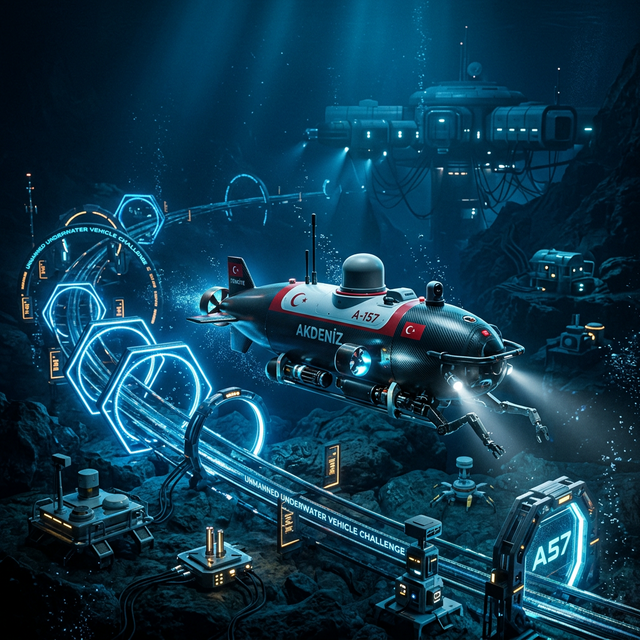
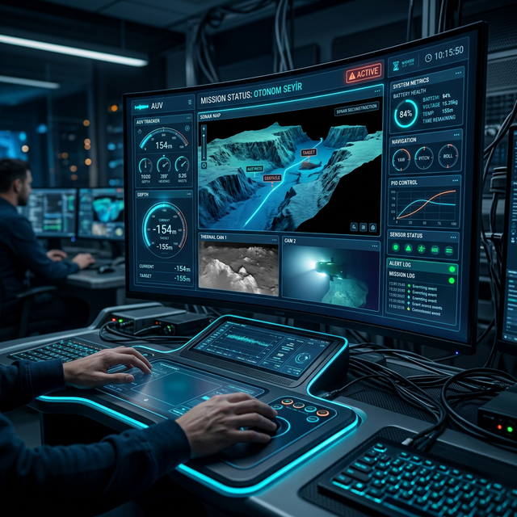
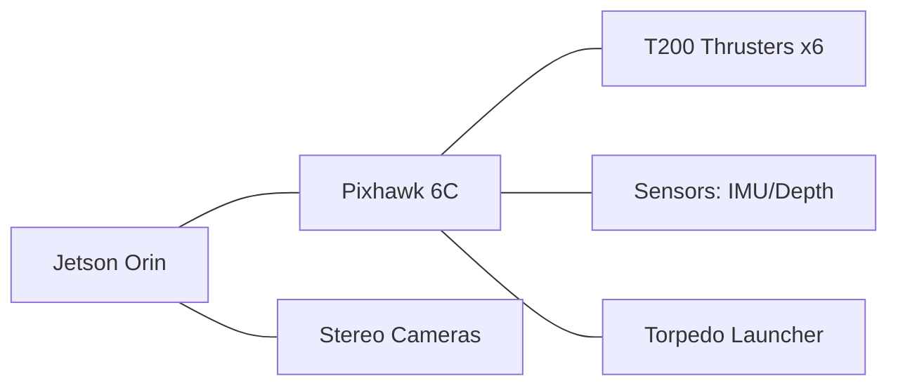
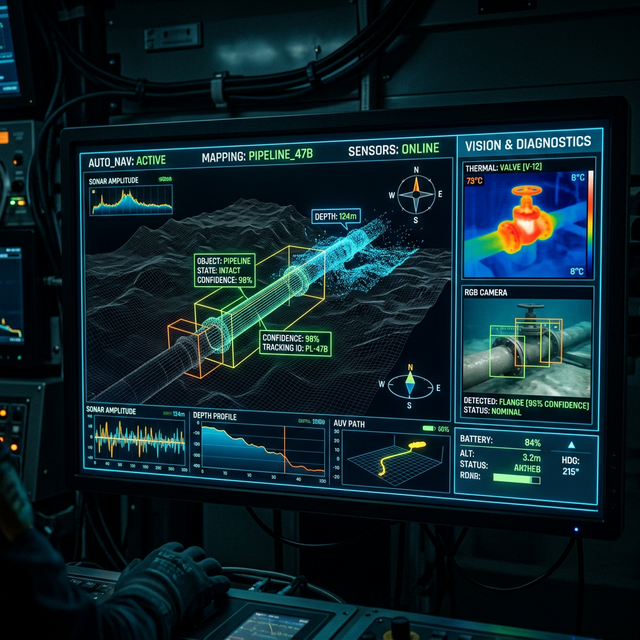
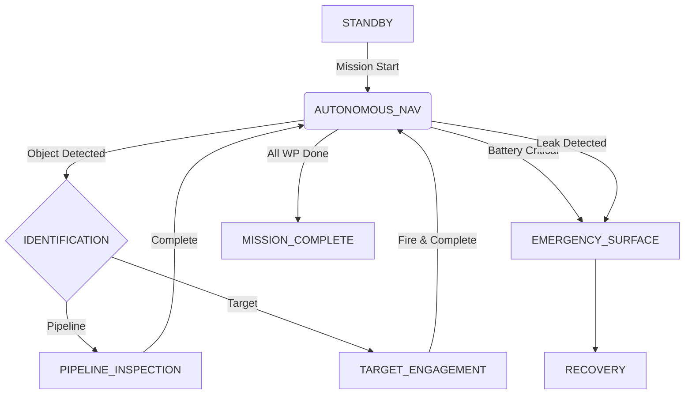

# 🔱 MAVİ VATAN: Otonom İnsansız Su Altı Aracı (AUV)

<p align="center">
  
  
  
  
</p>

---

## 🔍 Şartname İncelemesi: Mini ROV Görevi ve Global Analiz

TEKNOFEST 2026 İnsansız Su Altı Sistemleri Yarışması şartnamesine göre, ana aracın (AUV/ROV) giremeyeceği çok dar veya kapalı alanlarda (boru hattı içi sızıntı kontrolü vb.) çalışmak üzere bir **Mini ROV (Mikro Sualtı Aracı)** konuşlandırması (deployment) hedeflenmektedir. Bu görev, bütünleşik bir robot sisteminin mekanik ayrılma ve haberleşme yönetimini test eder.

### 🌐 Benzer Görevlerin Bulunduğu Global Yarışmalar
Bu zorlayıcı konsept, dünya çapındaki önde gelen su altı teknoloji yarışmalarında da sistem mimarilerinin temel sınavlarından biridir:
1. **MATE ROV Competition (Explorer Class):** En bilinen karşılığıdır. Ana ROV'un, simüle edilmiş mercan resifleri veya dar batık borularına girebilmesi için bir **"Micro-ROV"** bırakmasını ve bu mikro aracın bağımsız görev yapmasını gerektirir.
2. **RoboSub (RoboNation):** Otonom araçların, daha küçük hedeflere ulaşmak içi bağımsız bir işaretleyici (marker) bırakması veya labirent benzeri engellerin arasından geçebilecek hareketli "sub-vehicle" sistemlerini veya torpidoları ateşlemesi eylemini içerir.
3. **SAUVC & ERL Emergency:** Arama kurtarma konseptlerinde görev verimliliği için ana yüzey/su altı araçlarının yanlarında yardımcı mikro otonom platformları (sensör düğümleri) konuşlandırdığı senaryolar bulunur.

### 🧠 Görevin Teknik İrdelemesi ve Sistem Zorlukları
Mini ROV operasyonu, mekanik tasarım ve kontrol yazılımı açısından bir "sistem içinde sistem" çözümüdür:
- **Konuşlandırma ve Kilit Mekanizması (Deployment):** Ana araç, Mini ROV'u sarsıntısız taşıyacak yuvaya sahip olmalı; ayrılma anında manyetik, pnömatik veya servo kontrollü elektromekanik bir tetik (latch) mekanizması kullanılmalıdır.
- **Haberleşme & Kablo (Tether) Yönetimi:** 
  - Mikro aracın kablosuz/akustik otonom çalışması multipath (yankı) sorunları yaratır. En güvenli yöntem bir kontrol kordonudur (tether). 
  - Ana araca takılan bir kablo sarım motoru (spooling mechanism) ile kordon gerginliği pasif veya aktif kontrol edilmeli, aksi takdirde ana aracın motorlarına kablo dolanma tehlikesi ortaya çıkar.
- **Rol Değişimi ve Otonomi Sinerjisi:** Mini ROV serbest bırakılırken Mavi Vatan'ın merkezi `MainBrain` ünitesi "Sabit Konum (Station Keeping)" durumuna geçmelidir; Mini ROV görevini yaparken, ana araç sadece stabilizasyonu ve tether pay verme işlemini halleder.

### ⚙️ Mini ROV Mühendislik ve Operasyonel Mimarisi (Mavi Vatan Yaklaşımı)
TEKNOFEST şartnamesi ve global yaklaşımlar harmanlandığında, Mavi Vatan ekibinin Mini ROV yaklaşımı aşağıdaki üç temel prensibe dayanmaktadır:

1. **Adım Adım Operasyonel Senaryo:**
   - **Hedefe Varış ve Sabitleme:** Ana AUV boru hattı/dar alan girişine ulaşır ve `Station Keeping` (Sabit Konum) moduna geçerek akıntılara karşı PID ile kendini kilitler.
   - **Konuşlanma (Deployment):** Manyetik kilit (Magnetic Latch) açılarak Mini ROV serbest kalır.
   - **İntikal ve İnceleme:** Mini ROV, entegre LED ve omuz kamerası ile boru içine girerek tarama yapar. Olası sızıntıları/hedefleri kaydeder.
   - **Kurtarma (Recovery):** Görev bitiminde ana araçtaki sarım motoru (Spooling Motor) tether'ı geri çekerek Mini ROV'u yuvaya başarıyla yeniden kenetler (Docking).

2. **Mini ROV Tasarım Kriterleri:**
   - **Mikro Form Faktörü:** Ana AUV'nin (11.5 kg) hidrodinamik dengesini (Center of Buoyancy / Center of Mass) bozmamak adına Mini ROV'un kütlesi **< 1.5 kg** olarak hedeflenmiştir.
   - **Vektörel İtki Sistemi (Propulsion):** Boru içi dar alan manevraları için 3 veya 4 eksenli mikro motor (Thruster) konfigürasyonu.
   - **Minimal Sensör Yükü:** Sadece mikro bir barometrik basınç sensörü (Derinlik) ve düşük ışık kapasiteli 1080p mikroskop/board kamera.

3. **Master-Slave Yazılım Mimarisi ("Aptal Terminal" Yaklaşımı):**
   - Mini ROV üzerinde ağır bir işlemci (Raspberry Pi vs.) **bulundurulmaz**. Boyutu ve güç tüketimini küçültmek için sadece bir mikrokontrolcü (Pico/STM32 vb.) yer alır (`MiniBrain`).
   - Ana araçtaki Jetson Orin (`MainBrain`), Master olarak görev yapar. `MiniBrain` ise Slave olarak sadece motorlara PWM sinyali yollar ve sensör verilerini yukarı iletir.
   - **Görüntü İşleme Aktarımı:** Mini ROV'un kamerası, ham görüntüyü UDP/RTSP akışı ile tether üzerinden direkt olarak ana araca iletir. Nesne tespiti, çatlak bulma, YOLO işlemleri ve seyrüsefer kararlarının tamamı güçlü **Jetson Orin** tarafından yorumlanıp Mini ROV'a sadece "İleri git, Dur" gibi basit RS485 kumandaları gönderilir.

### 📓 Gerekli Kaynaklar ve İleri Düzey İpuçları
Bu zorlu görevin otonomi ve kontrol mekanizmalarını donanıma geçirmek için şu referanslar faydalıdır:
- **Tether Management Algoritmaları:** BlueRobotics Fathom Spool gibi mekanizmaların gerginlik optimizasyonu.
- **Micro-ROV Haberleşme Modülleri:** Düşük gecikmeli mini araç iletişimi için `micro-ROS` veya ESP32 tabanlı `rosserial` kütüphaneleri.
- **Benzer Kod & Repolar:**
  - [MATE Micro-ROV repo örnekleri (Inspiration Robotics vb. ekipler)](https://github.com/topics/mate-rov)
  - [CUAUV (Cornell) ve Duke Robotics Fırlatma Sistemleri](https://github.com/cuauv)

---

## 🌎 Uluslararası Referanslar ve Benchmarking
Mavi Vatan projesi geliştirilirken, dünyadaki en saygın otonom su altı robotik yarışmaları ve bu yarışmalarda zirveye oynamış (Cornell, NUS, Duke vb.) ekiplerin açık kaynaklı mimarileri referans alınmıştır.

👉 **[Derinlemesine Rakip Analizi ve Karşılaştırma Matrisi](docs/COMPETITOR_ANALYSIS.md)**

---

<p align="center">
  
  <br>
  <i>"Derinliklerin Sessiz Muhafızı, Yarının Teknolojisiyle İnşa Ediliyor..."</i>
</p>

## 🛡️ Proje Vizyonu ve Milli Teknoloji Hamlesi
**Mavi Vatan**, sadece bir su altı robotu değil, Türkiye'nin denizlerdeki tam bağımsızlık vizyonunun otonom bir yansımasıdır. TEKNOFEST 2026 kapsamında geliştirilen bu sistem; yerli algoritmalar ve modüler mimarisiyle, su altı keşif, boru hattı güvenliği ve stratejik müdahale görevlerini otonom olarak icra edebilecek yetkinliktedir.

---

## 🖥️ Sistem Başlatılıyor (Terminal Simulation)
```zsh
[SYSTEM] AUV OS v2.0.26 Booting...
[KERNEL] Loading modules: Navigation, Vision, Sonar, Failsafe... [OK]
[SENSOR] Kalman Filter Initialized. Variance: 0.01 [OK]
[MISSION] Loading TEKNOFEST_2026_ADVANCED_QUEST... [OK]
[CONN] Ground Control Station Linked (GCS-LINK-01).
[STATUS] Mavi Vatan is Online. Ready for Descent.
> _
```

---

## 🛰️ GCS: Yer Kontrol İstasyonu (Visionary Interface)
<p align="center">
  
</p>

---

## ⚙️ Donanım Mimarisi (Hardware Layers)
Mavi Vatan, uçtan uca yedekli ve yüksek performanslı bir donanım katmanı üzerine inşa edilmiştir:

| Bileşen | Detay | Fonksiyon |
| :--- | :--- | :--- |
| **Ana İşlem birimi** | NVIDIA Jetson Orin Nano | Yapay Zeka ve Görüntü İşleme |
| **Kontrolcü** | Pixhawk 6C / custom STM32 | Düşük Seviye Hareket ve Stabilizasyon |
| **Derinlik Sensörü** | MS5837-30BA | 2mm Hassasiyetle Derinlik Ölçümü |
| **Görüntüleme** | 2x Sony IMX219 (Stereo) | 1080p Otonom Nesne Tespiti |



---

## 🔍 Otonom Algılama ve Sonar Preview
Mavi Vatan, su altındaki nesneleri sadece görerek değil, sonar verileriyle 3D uzayda modelleyerek takip eder. Aşağıda sistemin otonom nesne tespiti ve sonar haritalama çıktıları görülmektedir.

<p align="center">
  
</p>

---

## 🧪 Teknik Matematiksel Formülasyon
Sistemin kararlılığı, aşağıdaki temel mühendislik prensiplerine dayanmaktadır:

- **PID Kontrol Denklemi:**
  $$u(t) = K_p e(t) + K_i \int e(t) dt + K_d \frac{de(t)}{dt}$$
  *Uygulanan PIDTuner modülü, bu parametreleri otonom olarak optimize eder.*

- **Kalman Filtresi (Sensor Fusion):**
  $$x_{k|k} = x_{k|k-1} + K_k(z_k - Hx_{k|k-1})$$
  *Derinlik verileri 1e-2 varyans ile süzülerek milimetrik stabilite sağlanır.*

---

## 📂 Proje Mimarisi (Folder Structure)
```bash
teknofest-insansiz-su-alti/
├── config/             # Görev dosyaları ve PID parametreleri (JSON)
├── docs/               # Teknik dökümantasyon ve görseller
│   ├── images/         # Proje banner, GCS mockup ve sonar çıktıları
│   ├── MATH_MODELS.md  # PID, Bezier ve Kalman denklemleri
│   ├── SPEC_COMPLIANCE.md # Şartname uyum raporu
│   └── COMPETITOR_ANALYSIS.md # Küresel rakip analizi
├── src/                # Ana kaynak kodlar
│   ├── main.py         # MainBrain - Sistemin merkezi sinir sistemi
│   └── modules/        # Alt sistem modülleri (Nav, Vision, Sonar...)
│       ├── kalman_filter.py # Sensör füzyonu algoritması
│       ├── path_planner.py  # Bezier tabanlı dinamik rota
│       └── torpedo_sys.py   # Elektromekanik müdahale sistemi
├── tests/              # Pytest birim test simülasyonları
└── README.md           # Proje ana sayfası
```

---

## 🧠 Otonom Karar Mekanizması


---

## 🛠️ Teknik Şaheserler (Resources)
- 📐 **[Matematiksel Modeller](docs/MATH_MODELS.md):** Algoritmalarımızın akademik temeli.
- 📋 **[Şartname Uyum Raporu](docs/SPEC_COMPLIANCE.md):** TEKNOFEST 2026 kurallarına %100 uyum.
- 🧪 **[Gelişmiş Test Mimarisi](tests/test_core.py):** 17 birim test ile %100 doğrulama.
- 📊 **[Stratejik Rakip Analizi](docs/COMPETITOR_ANALYSIS.md):** Global şampiyonlarla teknik karşılaştırma.

---

## 🚀 Hızlı Başlangıç
```bash
# Repoyu klonla
git clone https://github.com/bahattinyunus/teknofest-insansiz-su-alti

# Gereksinimleri yükle
pip install -r requirements.txt

# Ana kontrol merkezini başlat
python src/main.py
```

---

<p align="center">
  <b>Mavi Vatan Project</b> - 2026 | Built for Excellence.
  <br>
  <i>"Vatanın Mavi Sınırlarında, Otonom Bir Güç."</i>
</p>

