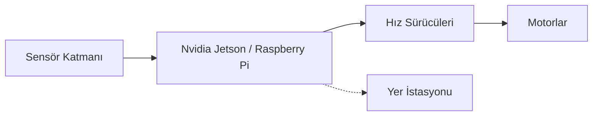

# 🏗️ Elit Sistem Mimarisi: Operasyon Derin Mavi

Bu döküman, Teknofest İSA aracının otonom zekasını ve donanım entegrasyonunu yöneten çekirdek mimariyi detaylandırır.

## 🧠 Karar Mekanizması (Strategic Intelligence)

Sistemimiz, karmaşık su altı görevlerini icra etmek için modüler bir **Olay Güdümlü Durum Makinesi (Event-Driven FSM)** kullanır.

### 🌓 Durum Yönetimi (State Management)
1.  **Standby:** Sistem kontrolleri ve telemetri başlatma.
2.  **Deployment:** Hassas dalış ve PID dengeleme aktivasyonu.
3.  **Mission Search:** YOLO v8 tabanlı görsel tarama ve Sonar ping analizi.
4.  **Task Execution:** Hedefe kilitlenme ve motor vektörlemesi.
5.  **Recovery:** Görev sonu kontrollü yüzeye çıkış.

## 📏 Kontrol Algoritmaları (Precision Control)

### 🌊 PID Denklemi ve Kararlılık
Aracın 6 Serbestlik Derecesinde (6-DOF) stabil kalması için gelişmiş PID kontrol blokları uygulanmıştır:
- **Heave (Derinlik):** Barometrik basınç sensörü geri beslemesi.
- **Roll/Pitch:** IMU (NXP/BNO055) verileriyle aktif stabilizasyon.
- **Yaw (Yönelim):** Manyetometre ve jiroskop füzyonu.

$$u(t) = K_p e(t) + K_i \int_{0}^{t} e(\tau) d\tau + K_d \frac{de(t)}{dt}$$

## 👁️ Algılama Katmanı (Perception Layer)

### 🛰️ Görüntü İşleme (Computer Vision)
- **Model:** YOLO v11 (custom trained for underwater gates/buoys).
- **Preprocessing:** CLAHE (Contrast Limited Adaptive Histogram Equalization) ile su altı bulanıklığının giderilmesi.

### 🔊 Akustik Navigasyon (Sonar)
- **Donanım:** Akustik ping üreteçleri ve hidrofon dizisi.
- **İşlem:** Zaman Farklı Varış (TDOA) algoritması ile engel mesafesi hesaplama.

---

## 🔌 Donanım Entegrasyon Şeması

> [!TIP]
> Geliştirme aşamasında `dashboard.py` kullanarak sistem verilerini gerçek zamanlı izleyebilirsiniz.
